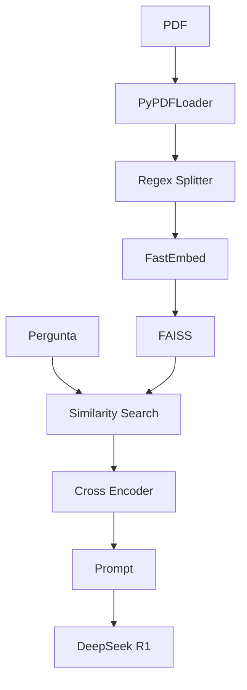
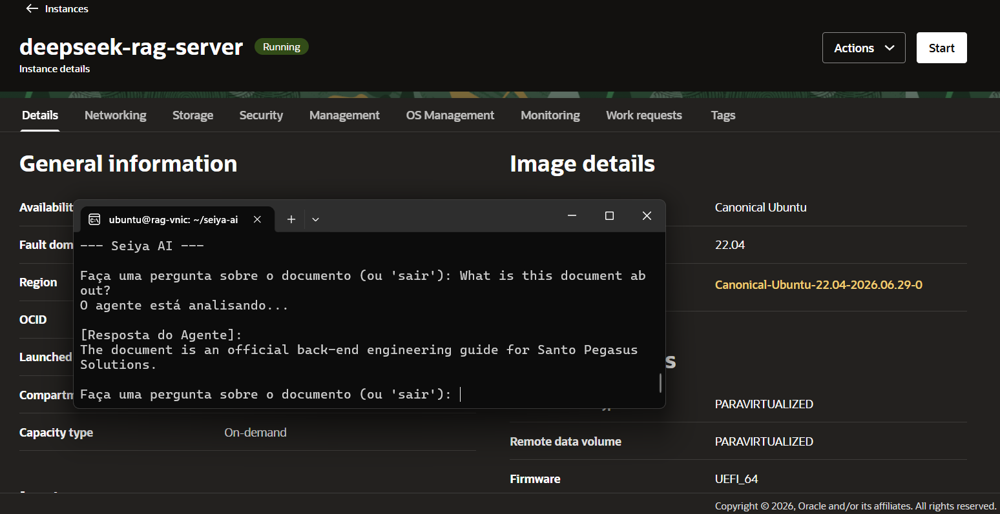
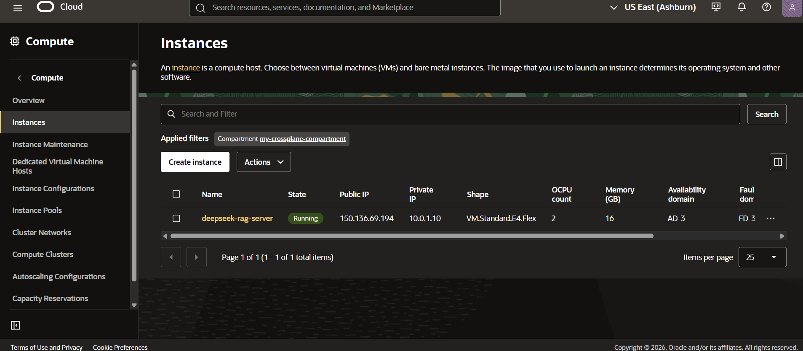
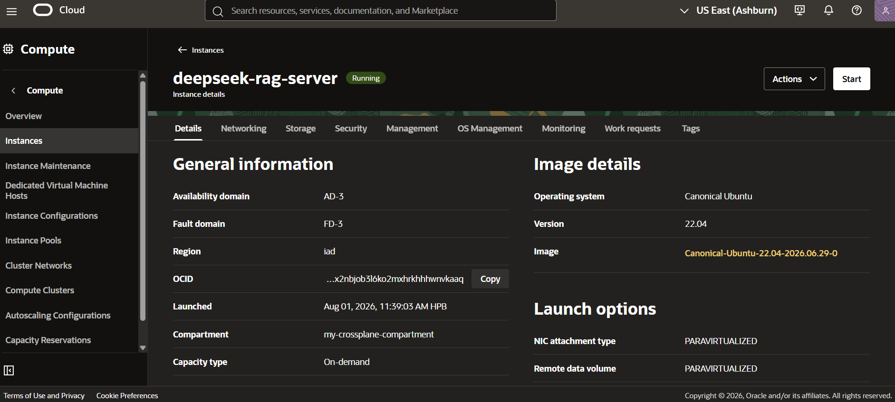
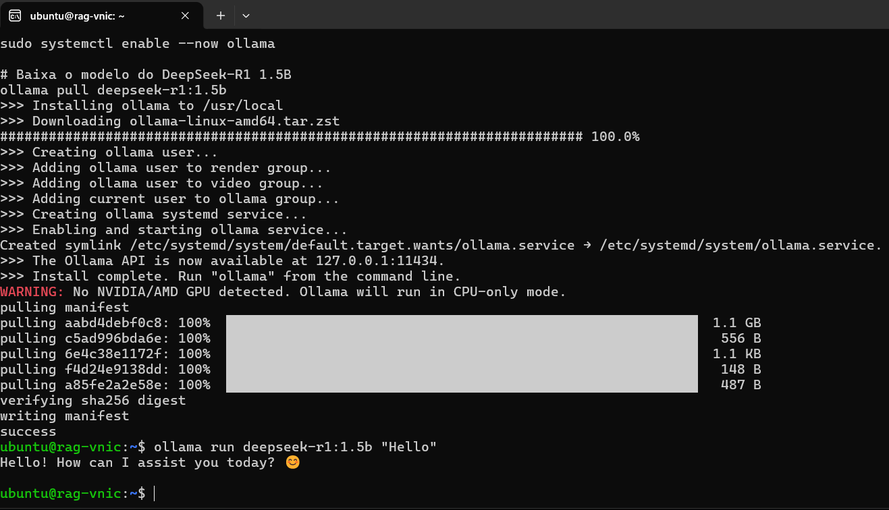

# 🎠 Seiya AI: Agente de IA para o Guia Oficial de Engenharia Back-end da Santo Pegasus Soluciones

**Atenção:** 
Este projeto foi desenvolvido como parte do challenge Tech AI Builder da Oracle Next Education (ONE) em parceria com a Alura, e está disponível em https://github.com/ShlomoChanoch/seiya-ai. A Santo Pegasus Soluciones é fictícia.

Este agente CLI foi desenvolvido para orientar engenheiros de software nos padrões de qualidade back-end da Santo Pegasus Soluciones. O sistema realiza segmentação semântica por seções, ranqueia com precisão as respostas através de uma arquitetura de duas etapas (*Retrieval + Re-ranking*) e responde a dúvidas com alta fidelidade ao contexto fornecido.

O modelo DeepSeek-R1 pode ser executado apenas em CPU, dispensando GPU dedicada, embora uma NVIDIA RTX 3060 12 GB reduza o tempo de inferência e melhore a velocidade de resposta. Lembre-se de que, quando uma GPU compatível está disponível, o Ollama pode utilizá-la para melhorar a inferência. Além disso, instalar o modelo **sem depender de chaves de API** é excelente para **soberania de IA** e evitar os preços dinâmicos, muito bom para ambientes on-premises sem data center dedicado.

---

## 📌 Arquitetura e Fluxo de Funcionamento

A arquitetura contém uma solução completa de **Retrieval-Augmented Generation (RAG)** local e privada, utilizando **LangChain**, **FAISS**, **FastEmbed**, **Cross-Encoder Re-Ranking** e o modelo **DeepSeek-R1 (1.5B)** via **Ollama**.




1. **Ingestão (`ingest.py`):** O PDF é carregado, fatiado em seções estruturadas via Regex, convertido em embeddings pelo **FastEmbed** e armazenado em um banco vetorial **FAISS** local.
2. **Recuperação e Re-ranking (`main.py`):**
   - **Busca Inicial (FAISS):** Busca K=15 trechos candidatos por similaridade vetorial.
   - **Re-ranking (Cross-Encoder):** Avalia e reordena os trechos calculando o *Cross-Score* direto entre a pergunta e o conteúdo do trecho, extraindo o candidato mais relevante (Top-1).
   - **Generic Query Override:** Identifica perguntas genéricas de resumo (ex: *"sobre o que é este documento?"*) e injeta automaticamente as seções iniciais do documento. Perguntas muito genéricas sofrem com buscas vetoriais, pois não possuem termos específicos. O nosso sistema retorna às seções introdutórias do documento.
3. **Geração (DeepSeek-R1):** O modelo R1 sintetiza a resposta estritamente baseada no contexto recuperado, reduzindo alucinações e limpando a cadeia de pensamento (`<think>...</think>`).

---

## 📁 Estrutura de Arquivos e Módulos

```text
├── data/
│   └── documento.pdf         # Arquivo PDF de entrada para processamento
├── imgs/                     # Imagens de documentação de uso do OCI e do agente
├── terraform/                # Configuração de infraestrutura na OCI (opcional)
│   ├── main.tf           
│   ├── outputs.tf
│   └── variables.tf
├── vectorstore/              # Índice de vetores persistido localmente pelo FAISS criado depois de usar o ingest.py
│   └── faiss_index/           
├── ingest.py                 # Script de carregamento, parsing e geração do índice FAISS
├── main.py                   # Agente interativo RAG com Re-Ranker e execução do DeepSeek-R1
├── debug_main.py             # Modo de depuração com visualização de chunks e scores de re-ranking
├── requirements.txt          # Dependências do projeto com hashes fixos para evitar problemas de compatibilidade
└── README.md                 # Documentação do projeto
```

---

## 🛠️ Detalhamento dos Componentes

### 1. `ingest.py` (Pipeline de Ingestão de Dados)

Responsável pelo pré-processamento do arquivo PDF e pela criação da base de conhecimento vetorial.

* **Carregamento:** Utiliza `PyPDFLoader` para ler as páginas de `data/documento.pdf`.
* **Divisão Estruturada por Seções:** Aplica expressão regular `r"\\n(?=\\d+(?:\\.\\d+)*\\.\\s)"` para fatiar o texto respeitando a numeração e títulos das seções (ex: `1.1. Introdução`), mantendo os metadados da página original.
* **Embeddings & Vetorização:** Gera embeddings locais via `FastEmbedEmbeddings` e constrói o índice vetorial no **FAISS**, salvando o resultado em `vectorstore/faiss_index`.

---

### 2. `main.py` (Agente de Consulta e Recuperação RAG)

Módulo principal de interação do usuário com a base de conhecimento.

* **Re-Ranking Avançado (`custom_retriever_with_reranker`):**
* Utiliza o modelo `cross-encoder/mmarco-mMiniLMv2-L12-H384-v1` via Hugging Face (`sentence_transformers`).
* Realiza a reordenação fina dos candidatos retornados pelo FAISS.
* Fornece um modo **Debug** interativo no terminal que exibe a pontuação (*Cross-Score*) de cada trecho analisado.


* **Tratamento de Perguntas Genéricas:** Detecta palavras-chave globais (ex: *"resuma"*, *"sobre o que"*). Em caso positivo, ignora o ranking vetorial pontual e retorna os trechos iniciais do documento (`all_docs[:2]`), garantindo um panorama geral assertivo.
* **Prompt Estrito de Extração:** O prompt instrui o modelo a responder apenas utilizando o contexto recuperado, proibindo o uso de conhecimento prévio ou complementação de informações ausentes.
* **Integração com Ollama & DeepSeek-R1:** Invoca o modelo `deepseek-r1:1.5b` e filtra o output com a função `clean_deepseek_output()`, removendo as tags internas de raciocínio (`<think>`).

---

## 🚀 Como Executar o Projeto

### Pré-requisitos

* **Python 3.10+** instalado.
* **Ollama** instalado e em execução.
* Modelo DeepSeek-R1 baixado diretamente no Ollama (não necessita chave de API):
```bash
ollama pull deepseek-r1:1.5b
ollama serve # use duas instâncias, um para servir e outro para usar o agente
```

---

### Passo 1: Instalar as Dependências

Crie um ambiente virtual (opcional, mas recomendado) e instale os pacotes necessários:

```bash
python -m venv .venv
source .venv/bin/activate
pip install --require-hashes -r requirements.txt
```
A flag --require-hashes garante que as versões das dependências sejam fixas, evitando problemas de compatibilidade.

Se você não deseja travar o `setuptools` no `requirements.txt`, garanta que seu ambiente já tenha o `setuptools` atualizado antes de rodar o `pip install`.

Se mesmo assim, houver problemas, apenas para fins de testes, você pode instalar sem travar as versões:

```bash
pip install langchain langchain-community langchain-core faiss-cpu fastembed sentence-transformers python-dotenv pypdf ollama
```

---

### Passo 2: Configurar Variáveis de Ambiente

Crie um arquivo `.env` na raiz do projeto contendo seu token do Hugging Face (caso queira evitar avisos de taxa de download):

```env
HF_TOKEN=seu_huggingface_token_aqui
```

---

### Passo 3: Adicionar o Documento e Executar a Ingestão

1. Execute o script de ingestão para criar a base FAISS:

```bash
python ingest.py
```

*Saída esperada:*

```text
1. Carregando o documento...
2. Dividindo o texto por seções mantendo os metadados...
3. Gerando embeddings locais para X trechos e salvando o índice...
Sucesso! Banco de conhecimento criado em 'vectorstore/faiss_index'.
```

---

### Passo 4: Iniciar o Agente de Chat

Execute o script principal para interagir com o documento via linha de comando:

```bash
python main.py # ou debug_main.py para ativar o modo Debug, que permite visualização de chunks e scores de re-ranking.
```

1. Digite sua pergunta em português ou inglês.
2. Para encerrar a sessão, digite `sair` ou `exit`.



---

## 🛠️ Tecnologias Utilizadas

| Componente | Tecnologia | Função |
| --- | --- | --- |
| **LLM** | Ollama (`deepseek-r1:1.5b`) | Geração de respostas baseada no contexto extraído |
| **Embeddings** | FastEmbed (`FastEmbedEmbeddings`) | Vetorização local e eficiente |
| **Vector Database** | FAISS | Busca vetorial por similaridade |
| **Re-Ranker** | Cross-Encoder (`mmarco-mMiniLMv2-L12-H384-v1`) | Re-ranqueamento por inferência de pares pergunta-documento |
| **Orquestração** | LangChain / LangChain Core | Conectores de componentes, loaders e prompts |
| **PDF Loader** | PyPDFLoader (`pypdf`) | Extração e parsing de PDF |

---

## ☁️ Infraestrutura na Nuvem da OCI

Usando os recursos de **Oracle Cloud Infrastructure (OCI)**, é possível criar uma instância de máquina virtual com GPU dedicada para acelerar a execução do modelo DeepSeek-R1. A pasta `terraform/` contém os arquivos de configuração para provisionar a infraestrutura necessária.

**Atenção:** A execução do modelo DeepSeek-R1 não requer GPU, mas a presença de uma GPU melhora significativamente o desempenho e a velocidade de resposta. Este manifesto Terraform **não** possui GPU dedicada (para cortar custos), mas você pode modificar o arquivo `main.tf` para adicionar uma GPU se desejar.

### 1. Configuração do Terraform

Crie uma arquivo chamado `terraform.tfvars` com suas credenciais da OCI e execute os comandos:

```bash
terraform init
terraform fmt
terraform validate
terraform plan
terraform apply -auto-approve
```




### 2. Acesso à VM

Entre na VM via SSH:

```bash
# Dica, o Terraform te entrega o IP da VM no output
ssh ubuntu@ip_da_vm
```

### 3. Instalação de Dependências e Ollama

Instale as dependências e o Ollama, e então execute o agente como descrito anteriormente.
```bash
sudo apt update && sudo apt upgrade -y
sudo apt install -y python3-pip python3-venv git curl build-essential
```

### 4. Instalação do Ollama

Garanta que o Ollama esteja instalado e o modelo DeepSeek-R1 baixado na VM.

```bash
# Instala o Ollama (caso não tenha instalado no boot)
curl -fsSL https://ollama.com/install.sh | sh

# Garante que o serviço está ativo
sudo systemctl enable --now ollama
```

### 5. Clonando o Repositório e Configurando o Ambiente Virtual

Na nova instância ssh, clone este repositório Git ou envie seus arquivos para a VM. Em seguida, dentro da pasta do projeto:

```bash
# Clonando repositório
git clone https://github.com/ShlomoChanoch/seiya-ai.git

# Entra na pasta do projeto
cd seiya-ai

# Cria o ambiente virtual
python3 -m venv .venv

# Ativa o venv
source .venv/bin/activate

# Baixa o modelo do DeepSeek-R1 1.5B
ollama pull deepseek-r1:1.5b

# Teste o modelo
ollama run deepseek-r1:1.5b "Hello"

# Deixe o modelo disponível na instância do terminal e abra outro em seguida
ollama serve
```



Prossiga como nas instruções de "Como Executar o Projeto".


## 📄 Limitações

O agente funciona com PDFs estruturados, mas não é capaz de lidar com PDFs escaneados ou imagens.

O Regex depende da numeração dos capítulos.

O modelo DeepSeek R1 1.5B possui capacidade limitada para perguntas muito complexas. Os vetores do RAG ajudam a mitigar esse problema, mas não eliminam completamente.
